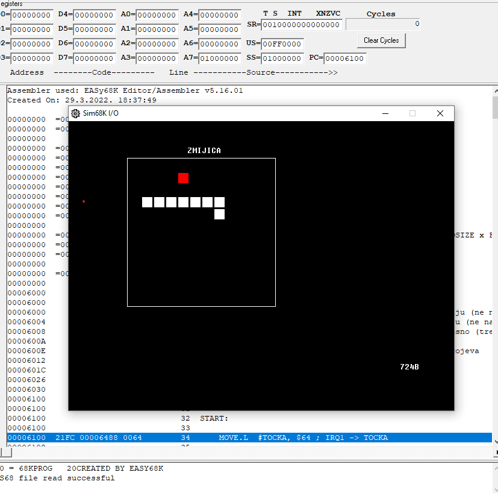
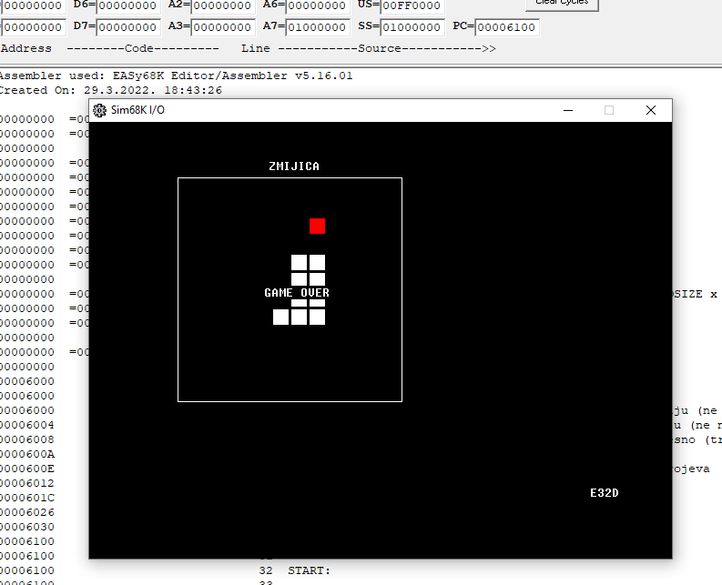

# Snake-moto68k

Game snake made in motorola 68k assembly language.

## Screenshots

## How to use

Download Easy68k emulator [here](http://www.easy68k.com/). And open kvazizmija.L68.

Enable exeptions in emulator options so that the game can be visualised. Go to options/enable exeptions.

Assemble the source (F9) and select execute.

Run the game (F9).
